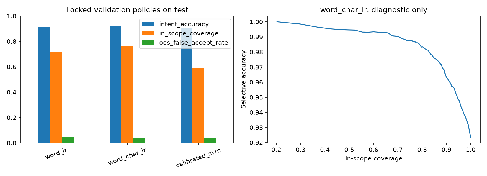
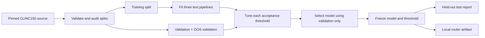
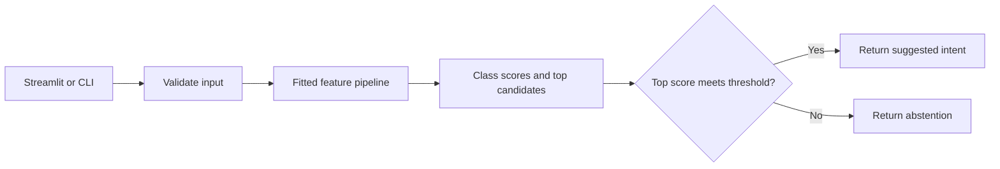

# IntentGate

**Route supported requests. Defer the rest.**

IntentGate classifies short English requests into 150 supported intents and returns an abstention when its model score falls below a validation-selected threshold. It runs locally, without an external model API, and measures the mistakes that ordinary classification accuracy hides.

A request such as “what is my account balance” returns a `balance` suggestion. A request such as “write a poem about a dragon on the moon” is rejected by the saved model. These are routing decisions, not permission to execute an action.

## Results

Evaluated on the official CLINC150 full test split: 4,500 supported and 1,000 unsupported requests. Every threshold—and the selected model—was chosen using validation data before test evaluation.

| Model | Intent accuracy | OOS AUROC | Supported coverage | Accuracy on accepted supported requests | Unsupported false acceptance |
|---|---:|---:|---:|---:|---:|
| Word TF-IDF + logistic regression | 91.02% | 0.9243 | 71.78% | 98.20% | 4.90% |
| **Word + character TF-IDF + logistic regression** | **92.36%** | **0.9497** | **76.09%** | **98.71%** | **4.00%** |
| Calibrated linear SVM | 90.93% | 0.9185 | 58.78% | 99.24% | 4.00% |

The selected word + character model accepts **3,424** supported requests and routes **3,380** of them correctly. It also wrongly accepts **40** unsupported requests. Counting those unsupported errors, accuracy across *all accepted requests* is **97.58%**, not 98.71%.

The SVM is more accurate on the smaller subset it accepts, but defers many more supported requests. The selected model offers the stronger validation tradeoff under the chosen false-acceptance constraint. This is a benchmark result, not a production guarantee.



Full evidence: [metrics](outputs/metrics.json), [validation selection](outputs/selection.json), [confident mistakes](outputs/high_confidence_errors.csv), [result interpretation](docs/results-interpretation.md).

## Architecture

### Offline: train, select, then evaluate



### Online: suggest an intent or abstain



The saved artifact contains preprocessing, classifier, model name and threshold. The Streamlit application caches the router rather than loading it on every request. There are no remote LLM calls, vector databases, agents or downstream action executors in this implementation.

Open [the standalone architecture diagram](docs/architecture.html) locally for a more detailed view. [Operating design](docs/operating-design.md) explains the proposed deployment boundaries: authentication, action authorization, review queues, observability and rollback. Those services are **not implemented** here.

## Why this design?

### A fixed intent vocabulary does not require generation

A supervised classifier is a useful starting point when outputs are known labels. Sparse models make the baseline inexpensive to train and easy to reproduce on CPU. Word features capture common phrasing; character features share evidence across word variants. These are classical NLP models—not a fine-tuned LLM or embedding model.

### Classification and acceptance are different decisions

A classifier will choose one of its known labels even for an unsupported request. The acceptance policy adds an explicit alternative: do not route. It maximizes the correctly routed fraction of supported validation traffic while allowing at most 5% empirical false acceptance on OOS validation examples.

Only 100 OOS validation examples are available. Meeting that empirical constraint does not guarantee the same error rate on future requests. Scores are not guaranteed probabilities of correctness, and abstention is not an authorization or safety mechanism.

### Calibration must not leak vocabulary

The calibrated SVM wraps the entire text pipeline in three-fold calibration. Each fold fits its own vocabulary and IDF statistics. The main validation split remains reserved for policy and model selection.

### Report useful coverage, not accuracy alone

A system that rejects almost everything can look accurate on the few requests it accepts. We report coverage, accepted accuracy and unsupported false acceptance together. Test threshold sweeps are diagnostic plots only; they do not change the saved policy.

## Dataset and data quality

[CLINC150](https://github.com/clinc/oos-eval) was published by Larson et al. at EMNLP-IJCNLP 2019. It contains crowdsourced, English, single-intent queries across 150 supported intents. It is **not real customer support traffic**.

| Split | Supported | Unsupported |
|---|---:|---:|
| Training | 15,000 | 100 |
| Validation | 3,000 | 100 |
| Test | 4,500 | 1,000 |

The downloader pins an upstream commit and records a SHA-256 checksum. Supported training classes are balanced. Unsupported training rows are intentionally unused; rejection uses the supported-class score rather than fitting a catch-all OOS class.

The audit checks blank text, class counts, duplicate rows, conflicting labels and normalized cross-split overlaps. There are **3 shared normalized texts between training and validation, and 2 between training and test**. Official splits are retained for comparability. A supplementary train-overlap-excluded test accuracy is reported; this does not remove every possible near-duplicate concern.

- [Dataset attribution and licensing](DATASET.md)
- [Independent provenance check](docs/dataset-provenance.md)
- [Machine-readable audit](outputs/data_audit.json)

The dataset is **CC BY 3.0**. Raw data and trained model artifacts are not committed. The small error-analysis excerpts and notebook samples are attributed dataset derivatives.

## Run locally

Python 3.11 is the tested version. Start from a fresh virtual environment.

```bash
python -m venv .venv
# Linux/macOS: source .venv/bin/activate
# Windows PowerShell: .venv\Scripts\Activate.ps1
# Windows Git Bash: source .venv/Scripts/activate
python -m pip install -r requirements.txt
python -m intent_gate.train
```

Training downloads the pinned dataset, audits it, fits all three models, selects the validation policy, evaluates the test split, and writes reports and local artifacts. Internet access is needed for dependencies and the initial dataset download; inference is local afterward.

### Interactive demo

```bash
streamlit run streamlit_app.py
```

### CLI

```bash
python -m intent_gate.inference "what is my account balance"
python -m intent_gate.inference "write a poem about a dragon on the moon"
```

The response includes `decision`, accepted `intent` or `null`, score, threshold, model name and top candidates. Blank inputs and inputs longer than 2,000 characters are rejected.

**Only load model artifacts you trust.** Joblib uses pickle-based deserialization and can execute code. Never accept arbitrary uploaded model files.

### Notebook

Read the [executed notebook](notebooks/01_intent_gate_executed.ipynb), or rerun the full experiment:

```bash
python -m nbconvert --to notebook --execute notebooks/01_intent_gate.ipynb \
  --output 01_intent_gate_executed.ipynb --ExecutePreprocessor.timeout=600
```

The notebook includes EDA, model rationale, validation policy, full training, results, errors, inference examples and an ML-practice checklist.

### Tests

```bash
python -m pytest -q
```

Run training first: the Streamlit integration test exercises the real local artifact. Tests cover policy selection, training-only vocabulary fitting, duplicate auditing, input validation, metric denominators and actual UI inference. CI trains the models, runs the tests and executes the notebook.

## Repository map

```text
intent_gate/
  data.py              # Pinned download, validation and overlap audit
  modeling.py          # Three pipelines and evaluation metrics
  policy.py            # Validation-only threshold selection
  train.py             # Reproducible training and held-out reporting
  inference.py         # Local routing API and CLI
notebooks/             # Source and executed experiment
outputs/               # Metrics, figures and error analysis
scripts/               # Notebook source generator
streamlit_app.py        # Local demo
tests/                 # Unit and UI integration tests
docs/                  # Architecture, operating design and interpretation
```

## Limits and next experiments

- Single-intent English only; no conversational context or multi-intent decomposition.
- Lexical features can miss semantic paraphrases and be confidently wrong on shared keywords.
- The benchmark OOS distribution does not represent every unsupported request.
- No broad hyperparameter sweep, transformer comparison or production load test has been run.
- No authentication, persistent review queue or actual customer actions are connected.

A useful next comparison is a frozen sentence encoder or fine-tuned transformer evaluated under the **same validation-only acceptance policy**, with measured latency and memory. Deployment should first add domain-specific labeled requests, time-separated evaluation, action authorization and reviewed feedback—not just a larger model.

## Reference

Stefan Larson et al. (2019). [An Evaluation Dataset for Intent Classification and Out-of-Scope Prediction](https://aclanthology.org/D19-1131/). EMNLP-IJCNLP, pp. 1311–1316. Dataset and derived examples: [CC BY 3.0](https://creativecommons.org/licenses/by/3.0/).
