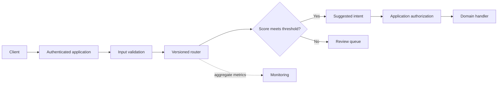

# Operating design

IntentGate makes a narrow decision: route an English request to a supported intent, or return it for review. It does not execute the request. A banking intent is a label, not permission to move money.

This document describes deployment decisions and extensions. The repository's local inference code and evaluation reports define what is currently implemented; queues, authentication, model registries and monitoring services below are deployment proposals.

## Boundaries

The router returns a recommendation. Authentication and authorization remain in the application, even when the classifier is confident. Human reviewers should see the original request only when their permissions allow it.

## Why use an intent model instead of an LLM call?

The output vocabulary is fixed. A supervised classifier gives repeatable decisions without a remote provider or per-request generation costs. It also provides a useful baseline before adding a more expensive semantic model.

The tradeoff is coverage. New intents require labeled examples and a new release. Unfamiliar wording may be rejected even when a human could easily understand it. Multi-intent requests need a separate policy; this benchmark contains single-intent requests.

## Abstention is a product decision

A score is not proof that the request belongs to a supported class. The threshold trades automatic handling against review volume. Select it on validation data that includes out-of-scope requests, then freeze it before test evaluation.

Track these separately:

- Supported-intent accuracy before rejection: can the classifier distinguish known intents?
- In-scope coverage: how much supported traffic gets an automatic suggestion?
- Selective accuracy: how often accepted supported requests get the right intent?
- Out-of-scope false acceptance: how often unsupported requests receive a supported label?
- Overall acceptance: depends on the mixture of supported and unsupported traffic.

A threshold that meets a target on a small validation set is not a guarantee for deployment. The benchmark's traffic mixture is not a forecast of production traffic. Report sample counts with rates and re-evaluate when traffic changes.

## Artifact contract

Deploy preprocessing, label mapping, estimator and threshold together. Record the data checksum, dependency versions and selection rule alongside them. Do not update the vocabulary while keeping the old estimator or copy a threshold from a different model.

For a service deployment, load one immutable artifact on startup. Validate it before marking the instance ready. Switch releases atomically and retain the prior artifact for rollback. Only load trusted pickle/joblib artifacts: deserializing an untrusted model can execute code.

## Review and feedback

Rejected requests belong in a bounded review queue. When review capacity is exhausted, return a clear unavailable response rather than silently lowering the threshold. Do not convert model predictions into training labels without review.

Review samples from both accepted and rejected traffic. Looking only at rejected requests misses confident mistakes. Keep a later, time-separated evaluation set when retraining on reviewed traffic.

## Failure handling

| Failure | Response |
|---|---|
| Missing or incompatible model | Fail startup; keep the previous release serving |
| Empty or oversized request | Reject input before vectorization |
| Unsupported request | Return abstention rather than execute a guessed action |
| Queue unavailable | Return retry/manual-contact status; do not claim a ticket exists |
| New unsupported intent appears | Collect reviewed examples; evaluate before enabling it |
| Monitoring unavailable | Keep routing if policy permits, but alert on missing telemetry |

## Privacy and observability

Prefer aggregate counts, latency distributions, predicted-label frequencies and score distributions. Do not log raw support messages by default; they may contain account details or personal information. Any retained examples need access controls, redaction, retention limits and a deletion process.

A rise in rejection rate can signal drift, an outage upstream, or genuinely different user needs. Label-frequency drift is an investigation trigger, not proof that model accuracy fell. Periodic labeled review is necessary to measure quality.

## Scaling

Start with one process and a model loaded once. Measure request latency, artifact memory and expected concurrency before adding infrastructure. CPU replicas behind a load balancer are a reasonable next step for sparse classifiers. Neural encoders may benefit from batching, but batching adds waiting time; benchmark the tradeoff before introducing GPU serving.

The repository's offline timings are not a service latency SLA. A deployment benchmark must include serialization, authentication, preprocessing, concurrent traffic and error paths.
